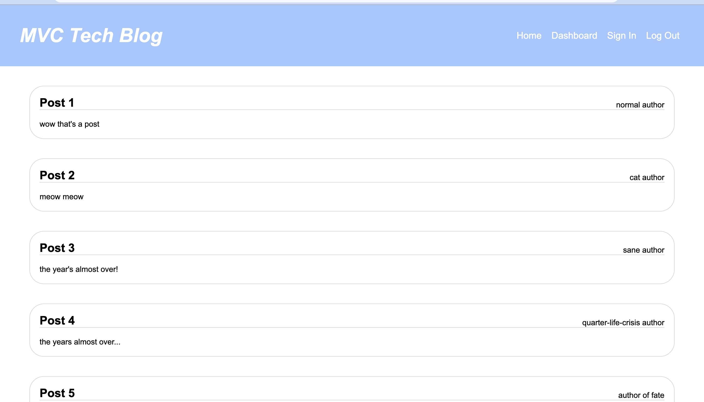

# MVC Tech Blog
MVC Tech Blog

## Description

MVC Tech Blog is a full-stack blog application that follows the Model-View-Controller (MVC) architectural pattern. Users can engage with the blog by signing up or signing in, viewing blog posts, leaving comments, and managing their own posts through a user-friendly dashboard.

### Key Features

1. **User Authentication:** Users can sign up, sign in, and log out securely.
2. **Home Page:** Access the home page to view all blog post titles, content, authors, and creation dates.
3. **Blog Post Details:** Click on any blog post to read it in full.
4. **Comments:** Leave comments on blog posts when signed in.
5. **User Dashboard:** Signed-in users can manage their own posts, including updating, adding new posts, and deleting existing ones.

## Installation

To install the necessary dependencies, run:
npm install

To seed the database with initial data, run:
npm run seed

To start the application, run:
npm start

# Usage

Here's a screenshot of what the site looks like

# Technologies Used
Node.js
Express.js
Sequelize (ORM)
Handlebars (View Engine)
MySQL (Database)
Passport (Authentication)
Heroku (Deployment)

# Contributing

License
This project is licensed under the MIT License.